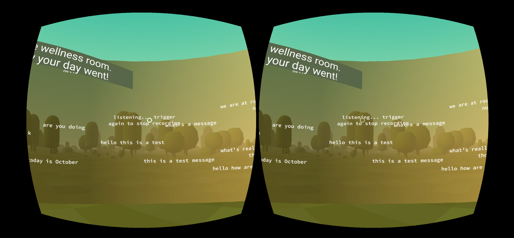

# Bulletin


## Bulletin VR

A WebVR bulletin board for sharing anonymous messages. This was part of our submission for YHack 2019, which won the Best VR/Gaming Hack. Checkout our [Devpost project](https://devpost.com/software/bulletin-fq1kaz)! 

## Inspiration

Social anxiety affects hundreds of thousands of people and can negatively impact social interaction and mental health. Around campuses and schools, we were inspired by bulletin boards with encouraging anonymous messages, and we felt that these anonymous message boards were an inspiring source of humanity. With Bulletin, we aim to bring this public yet anonymous way of spreading words of wisdom to as many people as possible. Previous studies have even shown that online interaction decreased social anxiety in people with high levels of anxiety or depression.



## What it does

Bulletin is a website for posting anonymous messages. Bulletin's various boards are virtual reality spaces for users to enter messages. Bulletin uses speech-to-text to create a sense of community within the platform, as everything you see has been spoken by other users. To ensure anonymity, Bulletin does not store any of its users data, and only stores a number of recent messages. Bulletin uses language libraries to detect and filter negative words and profanity. To try Bulletin ([https://bulletinvr.online](https://bulletinvr.online)), simply enter one of the bulletin boards and double tap or press the enter key to start recording your message.

## What is WebVR?

WebVR, or Web-based virtual reality, allows users to experience a VR environment within a web browser. As a WebVR app, Bulletin runs on the Oculus Rift, Oculus Go, HTC Vive, Google Cardboard, and your computer or mobile device. As the only limit is having an internet connection, Bulletin is available to all and seeks to bring people together through the power of simple messages.

## How we built it
We use the A-Frame JavaScript framework to create WebVR experiences. Voice recognition is handled with the HTML Speech Recognition API.

The back-end service is written in Python. Our JS scripts use AJAX to make requests to the Flask-powered server, which queries the database and returns the messages that the WebVR front-end should display. When the user submits a message, we run the message through the Python profanity-filter library to make sure it is appropriate and then save it to the database.

## Installation

Installing everything is very simple. After cloning the Repo to your computer, enter the folder.

If you don't have `virtualenv` installed for Python, run
``` bash
pip install virtualenv
```

Make a virtual environment:
``` bash
python -m venv virt
```

To activate the environment, on Windows run:
``` bash
virt\Scripts\activate
```

And on Linux or Mac run:
``` bash
source virt/bin/activate
```

To install the necessary pip packages into the environment, run:
``` bash
pip install -r requirements.txt
```

Finally, to run the Python application, run:
``` bash
python application.py
```

Now you can go to `http://localhost:5000/` and use the application.

## Team Members
- [Kevin Chen](https://github.com/k3vnchen), [kevin.n.chen@yale.edu](mailto:kevin.n.chen@yale.edu)
- [Mykyta Solonko](https://github.com/msolonko), [mykyta.solonko@yale.edu](mailto:mykyta.solonko@yale.edu)
- [Hamilton Wan](https://github.com/wanh23), [hamilton.wan@yale.edu](mailto:hamilton.wan@yale.edu)
- [Brandon Zhu](https://github.com/quinamatics), [brandon.zhu@yale.edu](mailto:brandon.zhu@yale.edu)


